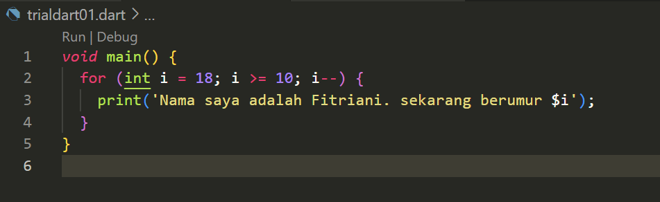
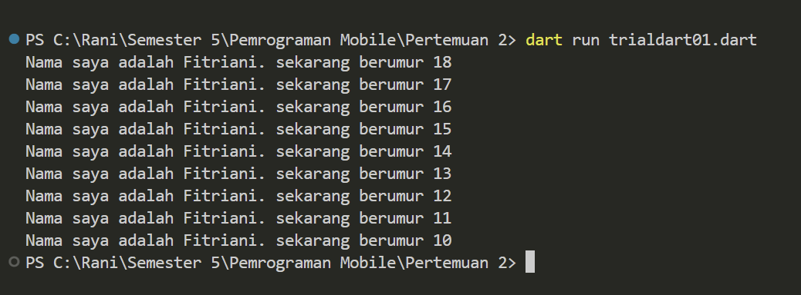

Nama    : Fitriani Novita Maharani
Kelas   : TI-3D
NIM/Absen : 2241720235 / 11
# Tugas Praktikum
**Soal 1**
Modifikasilah kode pada baris 3 di VS Code atau Editor Code favorit Anda berikut ini agar mendapatkan keluaran (output) sesuai yang diminta!

Hasil : 

**Soal 2**
Mengapa sangat penting untuk memahami bahasa pemrograman Dart sebelum kita menggunakan framework Flutter ? Jelaskan!

Jawaban : 

Memahami bahasa pemrograman Dart sebelum menggunakan Flutter sangat penting karena Dart adalah bahasa dasar yang digunakan dalam pengembangan aplikasi Flutter. Pengetahuan tentang Dart membantu dalam menulis kode yang efisien, memanfaatkan fitur seperti hot reload dan debugging, serta memahami konsep pemrograman berorientasi objek yang diterapkan dalam Flutter. Dengan pemahaman Dart, pengembang dapat mengoptimalkan performa aplikasi dan memanfaatkan tooling serta ekosistem yang disediakan, sehingga meningkatkan produktivitas dan efektivitas dalam pengembangan aplikasi mobile.

**Soal 3**
Rangkumlah materi dari codelab ini menjadi poin-poin penting yang dapat Anda gunakan untuk membantu proses pengembangan aplikasi mobile menggunakan framework Flutter.

Jawaban : 

Poin-Poin Penting dari Codelab

**1. Pengenalan Bahasa Dart**
Inti dari Flutter: Dart adalah bahasa pemrograman yang digunakan oleh Flutter untuk membuat aplikasi seluler.
Fitur Utama Dart:
- Tooling Produktif: Kakas untuk menganalisis kode dan plugin IDE.
- Garbage Collection: Menangani dealokasi memori.
- ype Annotations (Opsional): Untuk keamanan dan konsistensi data.
- Statically Typed: Memastikan keamanan tipe data selama kompilasi.
- Portabilitas: Mendukung web dan kompilasi ke kode ARM dan x86.

**2. Cara Kerja Dart**
- Dart Virtual Machines (VMs):
- Kompilasi JIT (Just-In-Time): Untuk pengembangan dengan debugging dan hot reload.
- Kompilasi AOT (Ahead-Of-Time): Untuk performa optimal tanpa debugging dan hot reload.
- Hot Reload: Memungkinkan pengembang mendapatkan umpan balik cepat terhadap perubahan kode.

**3. Struktur Bahasa Dart**
- Sintaks: Mirip dengan bahasa pemrograman modern lainnya seperti C dan JavaScript.
- Orientasi Objek:
- Encapsulation: Menyembunyikan data.
- Inheritance: Pewarisan kelas.
- Composition: Menggunakan objek lain.
- Abstraction: Menyederhanakan antarmuka.
- Polymorphism: Menyediakan berbagai implementasi.
- 
**4. Operator Dart**
- Operator Aritmatika: +, -, *, /, ~/, %.
- Increment/Decrement: ++, --.
- Operator Relasional: ==, !=, >, <, >=, <=.
- Operator Logika: !, ||, &&.
- 
**5. Praktik dengan Dart**
- DartPad: Alat online untuk bereksperimen dengan Dart.
- Running Locally: Simpan kode ke file Dart dan jalankan dengan perintah dart your_file_name.dart.