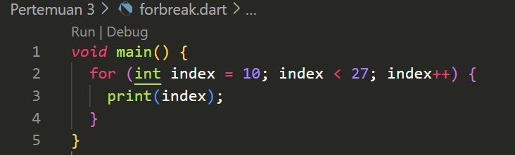

Nama    : Fitriani Novita Maharani<br>
Kelas   : TI-3D<br>
NIM/Absen : 2241720235 / 11<br>
# Tugas Praktikum
1. Silakan selesaikan Praktikum 1 sampai 3, lalu dokumentasikan berupa screenshot hasil pekerjaan beserta penjelasannya!
  
    <strong><span style="color:red">Praktikum 1: Menerapkan Control Flows ("if/else")</span></strong>
    
    
    >Akan muncul error, karena Dart mengharapkan ekspresi boolean di dalam kondisi if, namun test adalah String, bukan bool

    **Perbaikan:**<br>

    >

    <strong><span style="color:red">Praktikum 2: Menerapkan Perulangan "while" dan "do-while"</span></strong>

    

    >Akan menghasilkan error saat dieksekusi karena variabel counter belum dideklarasikan atau diinisialisasi.

    

    >Setelah perbaikan, program akan mencetak angka dari 0 hingga 32.
    
    

    <strong><span style="color:red">Praktikum 3: Menerapkan Perulangan "for" dan "break-continue"</span></strong>
    
    <br>

    **Silakan coba eksekusi (Run) kode pada langkah 1 tersebut. Apa yang terjadi? Jelaskan! Lalu perbaiki jika terjadi error.** <br>
    >Error: Index seharusnya index (huruf kecil) dan variabel harus diinisialisasi dalam for-loop.
    Perbaikan: Ganti Index dengan index dan tambahkan index++ untuk memastikan perulangan berjalan dengan benar.<br>

    
    

`   <br>
    <br>
    **Apa yang terjadi ? Jika terjadi error, silakan perbaiki namun tetap menggunakan for dan break-continue.**<br>
>- Error pada kondisi if dan else if: Penulisan "if" dan "else if" harus dimulai dengan huruf kecil.
>- Kondisi pada else if: Kondisi index > 1 || index < 7 tidak tepat untuk range 10 hingga 26. Karena ini akan selalu true bagi nilai "index", kecuali index == 7, maka "continue" akan dieksekusi terus-menerus, sehingga hanya nilai index == 7 yang dicetak. Ini mungkin bukan yang diinginkan.

**Perbaikan:**<br>
    
    

2. Buatlah sebuah program yang dapat menampilkan bilangan prima dari angka 0 sampai 201 menggunakan Dart. Ketika bilangan prima ditemukan, maka tampilkan nama lengkap dan NIM Anda.<br>
   Hasil :<br>
    ```dart
    void main() {

        String namaLengkap = 'Fitriani NM'; 
        String nim = '2241720235'; 
        
        print('Bilangan Prima dari 0 sampai 201:');
        
        // Looping dari 2 sampai 201
        for (int i = 2; i <= 201; i++) {
            if (isPrima(i)) {
            print('$i adalah bilangan prima - $namaLengkap, NIM: $nim');
            }
        }
    }

    // Fungsi untuk mengecek apakah sebuah angka adalah bilangan prima
    bool isPrima(int number) {
        if (number < 2) return false;

        for (int i = 2; i <= number ~/ 2; i++) {
            if (number % i == 0) {
            return false;
            }
        }
        return true;
    }
    ```
    <br>

    >
    >

   
3. Kumpulkan berupa link commit repo GitHub pada tautan yang telah disediakan di grup Telegram!