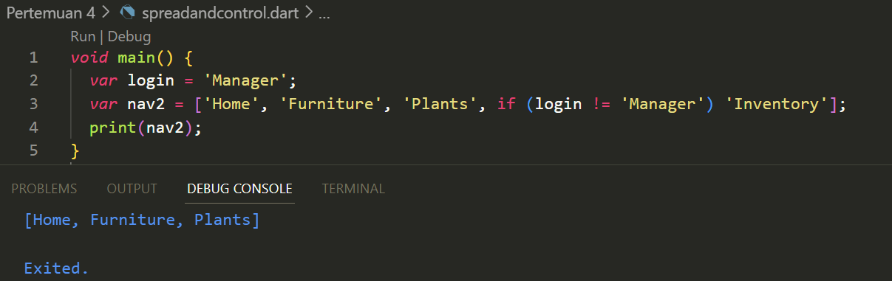

Nama    : Fitriani Novita Maharani<br>
Kelas   : TI-3D<br>
NIM/Absen : 2241720235 / 11<br>
# Tugas Praktikum
1. Silakan selesaikan Praktikum 1 sampai 5, lalu dokumentasikan berupa screenshot hasil pekerjaan Anda beserta penjelasannya!<br>
    
    Error code :
    
    Fixed Code:
    

   <br><strong>Praktikum 2 :</strong>
   Langkah 1 :
   
   >Ketika kode ini dijalankan, tidak ada error

   <br>Langkah 2 :
   
   >Ketika dijalankan, program ini akan mencetak 3 {}. Namun, tipe dari names3 adalah map, sehingga ketika menambahkan elemen dengan .add(), akan ada error karena fungsi ini tidak ada pada map.

   Nama + NIM :
   

   <br><strong>Praktikum 3 :</strong>
   
    >gifts: Merupakan map dengan String sebagai key dan campuran tipe data String dan int sebagai value.
    nobleGases: Merupakan map dengan int sebagai key dan campuran tipe data String dan int sebagai value.
    Ketika kode ini dijalankan, tidak ada error
    
    <br>Langkah 3 :
   
   >Error yang mungkin muncul adalah pada variabel gifts dan nobleGases karena pada langkah awal mereka memiliki value dengan tipe campuran (integer dan string), namun saat dimodifikasi pada langkah 3, value pada key 'fifth' dan 18 diubah menjadi string. Meskipun Dart secara dinamis mengizinkan perubahan tipe data, jika tipe map lebih spesifik (seperti Map<String, String> untuk gifts), perubahan ini akan menyebabkan error tipe.

   

   <br><strong>Praktikum 4 :</strong>
   

   >Kode ini mendeklarasikan dua list, list dengan nilai [1, 2, 3] dan list2 yang menggunakan Spread Operator (...) untuk menambahkan seluruh elemen dari list ke dalam list2.
    Error: Variabel list1 digunakan sebelum dideklarasikan. Dart akan menampilkan error karena list1 tidak pernah didefinisikan.

    <br>Langkah 2:
    Perbaikan: Deklarasikan list1 terlebih dahulu.
   

    <br>Langkah 3:
   
    Langkah 4:
    Output ketika promoActive = true:
   
    Output ketika promoActive = false:
   

   >Control-flow Operator (if) di dalam list akan menambahkan elemen 'Outlet' jika promoActive bernilai true. Jika false, 'Outlet' tidak akan ditambahkan.


    <br>Langkah 5:
    >Operator if akan menambahkan 'Inventory' ke dalam list jika login adalah 'Manager'.

    Output ketika login = 'Manager':
   
    Output ketika login != 'Manager'
   

    <br>Langkah 6:
   
   >Collection For digunakan untuk mengiterasi list listOfInts dan menambahkan string # di depan setiap elemen.
    Manfaat Collection For: Memungkinkan pengulangan langsung dalam deklarasi list tanpa perlu membuat loop terpisah.

   <br><strong>Praktikum 5 :</strong>
   <br>Langkah 1:
    

   <br>Langkah 2:
    >Records adalah tipe data baru di Dart 3.0 yang memungkinkan kita mengelompokkan berbagai nilai tanpa harus membuat class. Pada kode ini, record menyimpan beberapa field yang dapat diakses menggunakan nama (seperti a, b) atau indeks posisional.<br> - Error: Tidak ada error<br>

   <br>Langkah 3:
    
   >Pada Dart versi sekarang, tidak semua compiler atau interpreter mendukung langsung destructuring menggunakan `var (a, b) = record`. Oleh karena itu, kita menggunakan properti `$1` dan `$2` untuk mengakses elemen dalam record. `$1` mengakses elemen pertama, dan `$2` mengakses elemen kedua.

   <br>Langkah 4:
    

   <br>Langkah 5:
    


2. Jelaskan yang dimaksud Functions dalam bahasa Dart!<br>
   Jawaban : <br>
   Dalam bahasa Dart, function adalah blok kode yang digunakan untuk menjalankan tugas atau perhitungan tertentu. Fungsi dapat didefinisikan dengan kata kunci void (untuk fungsi tanpa nilai balik) atau dengan tipe data yang sesuai untuk fungsi yang mengembalikan nilai. Fungsi mempermudah penggunaan kembali kode dan memecah tugas-tugas menjadi bagian kecil yang lebih terorganisir.
   Contoh :
   ```dart
   void greet(String name) {
      print("Hello, $name!");
   }
      
   int add(int a, int b) {
      return a + b;
   } 
   ```

3. Jelaskan jenis-jenis parameter di Functions beserta contoh sintaksnya!<br>
   Jawaban :
   Dart mendukung beberapa jenis parameter:

   - Positional Parameters: Parameter ini harus diisi sesuai urutannya.
   ```dart
   void printInfo(String name, int age) {
   print("$name is $age years old.");
   }
   Pemanggilan: printInfo("John", 25);
   ```
   - Optional Positional Parameters: Parameter yang bersifat opsional dan dapat dilewati.
   ```dart
   void printInfo(String name, [int age]) {
   print(age != null ? "$name is $age years old." : "$name");
   }
   ```
   Pemanggilan: printInfo("John");

   - Named Parameters: Parameter yang bisa disebutkan saat memanggil fungsi.

   ```dart
   void printInfo({required String name, int age = 30}) {
     print("$name is $age years old.");
   }
   ```
   Pemanggilan: printInfo(name: "John");

   - Optional Named Parameters: Named parameters yang opsional.

   ```dart
   void printInfo({String name = "Guest", int? age}) {
   print("$name is $age years old.");
   }
   ```
   Pemanggilan: printInfo();<br>

4. Jelaskan maksud Functions sebagai first-class objects beserta contoh sintaknya!<br>
   Jawaban :
   Fungsi di Dart dianggap sebagai first-class objects, yang artinya fungsi dapat disimpan dalam variabel, dipassing sebagai argumen ke fungsi lain, dan dikembalikan sebagai nilai dari fungsi lain.
   Contoh <br>
   

5. Apa itu Anonymous Functions? Jelaskan dan berikan contohnya!<br>
   Jawaban :<br>
   Anonymous Functions adalah fungsi tanpa nama yang dapat digunakan langsung di tempat fungsi dibutuhkan. Ini sering digunakan sebagai parameter atau dalam operasi sederhana.
   Contoh
   ```dart
   var numbers = [1, 2, 3, 4];
   numbers.forEach((num) {
      print(num * 2);
   });
   ```
   Dalam contoh di atas, fungsi yang diberikan ke forEach adalah anonymous function yang mengalikan setiap angka dengan 2.<br>

6. Jelaskan perbedaan Lexical scope dan Lexical closures! Berikan contohnya!<br>
   Jawaban :
   - Lexical Scope adalah aturan yang menentukan bagaimana variabel dicari berdasarkan lokasi di mana variabel dideklarasikan di dalam kode. Dalam lexical scope, variabel yang dideklarasikan di dalam satu blok hanya bisa diakses di dalam blok tersebut atau di dalam blok bersarang.
      >Contoh Lexical Scope:
   

   - Lexical Closures adalah fungsi yang dapat "menutup" variabel dari lexical scope di luar fungsi itu dan mengingat nilainya bahkan setelah konteks di mana variabel itu dideklarasikan selesai dieksekusi. 
     >Contoh Lexical Closure:
   
  
7. Jelaskan dengan contoh cara membuat return multiple value di Functions!<br>
   Jawaban :
   Di Dart, kita bisa mengembalikan beberapa nilai dengan menggunakan tuples atau Records (Dart 3.0) atau menggunakan class untuk membungkus beberapa nilai.
   >Contoh dengan Record:
   

   <br>

   >Contoh dengan class:
   
