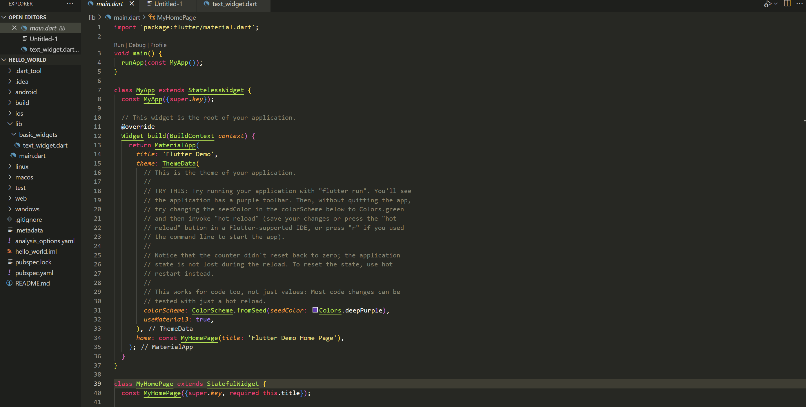

Nama    : Fitriani Novita Maharani 
Kelas   : TI-3D 
NIM/Absen : 2241720235 / 11 
# Tugas Praktikum 
## Tugas Praktikum 1
**Membuat Project Flutter Baru*
1. Buka VS Code, lalu tekan tombol Ctrl + Shift + P maka akan tampil Command Palette, lalu ketik Flutter. Pilih New Application Project.

2. Kemudian buat folder sesuai style laporan praktikum yang Anda pilih. Disarankan pada folder dokumen atau desktop atau alamat folder lain yang tidak terlalu dalam atau panjang. Lalu pilih Select a folder to create the project in.

3. Buat nama project flutter hello_world seperti berikut, lalu tekan Enter. Tunggu hingga proses pembuatan project baru selesai.

4. Jika sudah selesai proses pembuatan project baru, pastikan tampilan seperti berikut. Pesan akan tampil berupa "Your Flutter Project is ready!" artinya Anda telah berhasil membuat project Flutter baru.
**Hasil :**
   

## Tugas Praktikum 2
**Menghubungkan Perangkat Android atau Emulator**
Melanjutkan dari praktikum 1, Anda diminta untuk menjalankan aplikasi ke perangkat fisik (device Android atau iOS). Silakan ikuti langkah-langkah pada codelab tautan berikut ini.
## Tugas Praktikum 3
Praktikum 3: Membuat Repository GitHub dan Laporan Praktikum
Melanjutkan dari praktikum 2, silakan selesaikan langkah-langkah berikut ini.

Perhatian: Diasumsikan Anda telah mempunyai akun GitHub dan Anda telah memahami konsep dasar dalam bekerja menggunakan Git pada pertemuan pertama.

Praktikum ini dapat Anda lewati langsung ke langkah 11 jika sudah paham cara membuat laporan praktikum sesuai style yang Anda pilih.

1. Login ke akun GitHub Anda, lalu buat repository baru dengan nama "flutter-fundamental-part1"
2. Lalu klik tombol "Create repository" lalu akan tampil seperti gambar berikut.
3. Kembali ke VS code, project flutter hello_world, buka terminal pada menu Terminal > New Terminal. Lalu ketik perintah berikut untuk inisialisasi git pada project Anda.
4. Pilih menu Source Control di bagian kiri, lalu lakukan stages (+) pada file .gitignore untuk mengunggah file pertama ke repository GitHub.
5. Beri pesan commit "tambah gitignore" lalu klik Commit (✔)
6. Lakukan push dengan klik bagian menu titik tiga > Push

7. Di pojok kanan bawah akan tampil seperti gambar berikut. Klik "Add Remote"
8. Salin tautan repository Anda dari browser ke bagian ini, lalu klik Add remote. Setelah berhasil, tulis remote name dengan "origin"

9. Lakukan hal yang sama pada file README.md mulai dari Langkah 4. Setelah berhasil melakukan push, masukkan username GitHub Anda dan password berupa token yang telah dibuat (pengganti password konvensional ketika Anda login di browser GitHub). Reload halaman repository GitHub Anda, maka akan tampil hasil push kedua file tersebut seperti gambar berikut.

10. Lakukan push juga untuk semua file lainnya dengan pilih Stage All Changes. Beri pesan commit "project hello_world". Maka akan tampil di repository GitHub Anda seperti berikut.

11. Kembali ke VS Code, ubah platform di pojok kanan bawah ke emulator atau device atau bisa juga menggunakan browser Chrome. Lalu coba running project hello_world dengan tekan F5 atau Run > Start Debugging. Tunggu proses kompilasi hingga selesai, maka aplikasi flutter pertama Anda akan tampil seperti berikut.
12. Silakan screenshot seperti pada Langkah 11, namun teks yang ditampilkan dalam aplikasi berupa nama lengkap Anda. Simpan file screenshot dengan nama 01.png pada folder images (buat folder baru jika belum ada) di project hello_world Anda. Lalu ubah isi README.md seperti berikut, sehingga tampil hasil screenshot pada file README.md. Kemudian push ke repository Anda. 
    >Hasil :
    

## Tugas Praktikum 4

## Tugas Praktikum 5